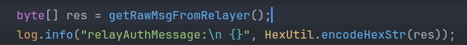
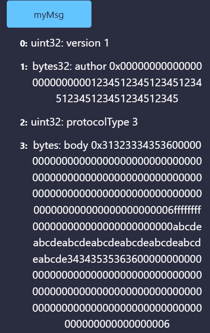
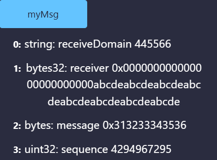

## 测试数据说明

下面给出一个测试AM合约的recvPkgFromRelayer时，一个输入用例：

`0x000000000000012c00002601000005001401000000000e01000000000801000000000006000000000000000000000000000000000000000000000000000000000000000000000000000000000000000000000000000000000000000000000000cdeabcde34343535363600000000000000000000000000000000000000000000ffffffff000000000000000000000000abcdeabcdeabcdeabcdeabcdeabcdeab0000000000000000000000000000000000000000000000000000000000000006313233343536000000000000000000000000000000000000000000000000000000000000000000000000000000000000000000000000000000000000000000a400000003000000000000000000000000123451234512345123451234512345123451234500000001090006000000313132323333`

上面是一个bytes类型的通用跨链数据包ucp。构造方式如下图：

第一行构造出ucp的原始bytes数据，方法内部如下，手动构造了易于识别的数据。

第二行用了java的cn.hutool.core.util库中的encodeHexStr将其可视化，得到了上述输入。

## 测试过程

在remix上导入ethereum-sample中的合约进行修改，只测试

- AM合约`recvPkgFromRelayer`中的`decodeMessageFromRelayer`和`decodeAuthMessage`方法
- SDP合约的recvMessage中的反序列化方法（`sdpMessage.decode(pkg)`）

## 测试结果

用输入用例得到的测试结果如下：

- AM合约
  - 输入：上述测试用例
  - 输出：如下图，和构造的数据一致。

- SDP合约
  - 输入：AM合约中输出的bytes body
  - 输出：如下图，和构造的数据一致。

